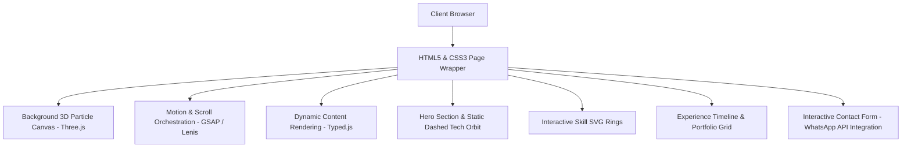

<p align="center">
  
</p>

<h1 align="center">🌌 Futuristic Developer Portfolio</h1>

<p align="center">
  
</p>

---

## 🚀 Badges

<p align="center">
  
  
  
  
</p>

---

## 🧑‍💻 About the Project

This is a **futuristic, premium, and fully responsive developer portfolio** showcasing expertise in **Full Stack Development, AI/ML Engineering, and Data Science**. 

Built with a dark space-inspired aesthetic, the portfolio represents a perfect blend of **clean engineering, custom CSS design, and interactive motion**.

---

## 🎨 Design Philosophy & UX

* **🌑 Futuristic Space Theme**: Uses a dark mode palette with vibrant gradient accents (Cyan, Purple, Green) and glassmorphism cards.
* **✨ Live Interactive Orbit**: Features a static dashed track with 10 technology icons orbiting smoothly, matching the reference design layout.
* **🪐 Motion & 3D Depth**: Powered by Three.js 3D particles canvas and GSAP scroll-driven animations for an immersive first impression.
* **📱 Mobile First & Responsive**: Adaptable grid layouts and custom navigation drawers for smartphones, tablets, and desktops.

---

## 🏗️ Architecture & Component Flow



---

## 🛠️ Technology Stack & Libraries

### 💻 Technologies
* **Frontend**: HTML5, Vanilla JavaScript, CSS3
* **Framework**: Tailwind CSS (Configuration extended with custom animations and keyframes)

### 🎨 Libraries & Libraries Integration
* **3D Background**: [Three.js](https://threejs.org/) for rendering the interactive particle field.
* **Animations**: [GSAP](https://gsap.com/) & [ScrollTrigger](https://gsap.com/docs/v3/Plugins/ScrollTrigger/) for smooth scroll-driven reveals and counters.
* **Scroll Engine**: [Lenis](https://lenis.darkroom.engineering/) for high-performance inertial smooth scrolling.
* **Effects**: [Typed.js](https://github.com/mattboldt/typed.js) for typing role strings, [Boxicons](https://boxicons.com/) for tech badges and social links.

---

## 📂 Project Sections

### 🏠 Home / Hero
* Vibrant roles tags: `🚀 FULL STACK DEVELOPER`, `🤖 AI ENGINEER`, `📊 DATA SCIENTIST`.
* Live statistical counters (Projects, months experience, skills).
* A single static dashed track containing orbiting tech icons that counter-rotate to stay upright. Clicking an icon shows a persistent tooltip.

### 👤 About Profile
* Professional profile details (DOB, Location, expertise summaries).
* A terminal-style Python code box showcasing developer traits.

### 📊 Technical Skills
* Dynamic SVG circular rings that fill up based on data attributes.
* Colored technology tags for quick assessment.

### 💼 Experience & Timeline
* A custom interactive vertical timeline mapping key software engineering internships (Keyanna Technology, Grownited, CSRBOX).

### 📂 Projects & AI Showcase
* A filtered grid separating full-stack web projects and core machine learning models/agents.

### 📬 Contact
* Fully interactive message form sending typed info directly to WhatsApp API with custom formatting.
* A live digital clock showing local time.

---

## 🏁 How to Run Locally

Since this is a lightweight frontend project, you can host or run it locally in a second:
1. Clone the repository:
   ```bash
   git clone https://github.com/Sadique721/Portfolio.git
   ```
2. Navigate to the project folder:
   ```bash
   cd Portfolio
   ```
3. Spin up any local server (e.g., using python):
   ```bash
   python -m http.server 8000
   ```
4. Open your browser and go to `http://localhost:8000`.

---

## 🙌 Author

**Md Sadique Amin**  
💼 Full Stack Developer | 🤖 AI Engineer | 📊 Data Scientist  

⭐ *If you find this portfolio inspiring, please star the repository!*
